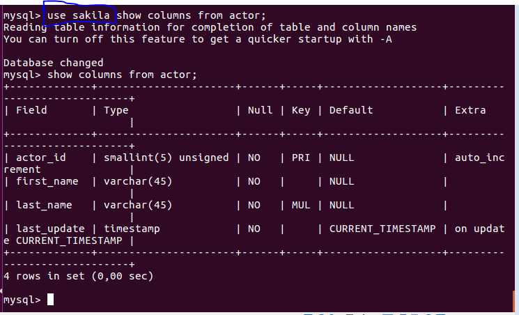

# Estructura del Diccionario de datos.

* **1. Interrogando la bases de datos Information_schema, extrae información (atributos table_name, table_type) sobre las tablas que conforman la base de datos "sarilla". (En el caso que no se haya instalado la BD Sakila de ejemplo, instalarla. Para eso ir a esta página https://dev.mysql.com/doc/sakila/en/sakila-installation.html)**

Lo primero que debemos hacer es ir a la página de descarga de la base de datos de `sakila` en https://dev.mysql.com/doc/index-other.html.

> Extraer el archivo que se descarga -> Insertar la línea de comando que aparece en la foto de arriba en el MySQL.

Vemos que tenemos ya la base de datos.

* **2. ¿Cuál es el comando SHOW equivalente al anterior?**

* **3. Repite lo mismo extrayendo la información sobre el esquema de una tabla en particular de la base de datos "sakila" (atributos column_name, data_type, is_nullable, column_default). Usar tabla columns**

`use Information_schema;`

* **4. ¿Cuál es el comando SHOW equivalente al anterior?**

* **5. Atendiendo a la base de datos "Information_schema", ¿cuáles son las tablas principales según tu criterio?**

A mi parecer, las tablas más importantes pueden ser **COLUMN_PRIVILEGES**, **ENGINES** y **USER_PRIVILEGES**. La primera almacena los datos de los privilegios correspondidos de las columnas y cómo utilizarlas. Engines implica una configuración global y los privilegios de usuario indican qué pueden o no hacer o cambiar los usuarios.

