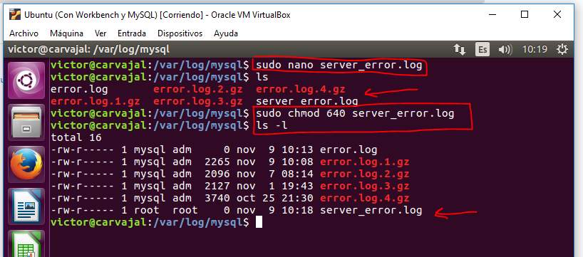

# Ficheros Log.

# Ficheros LOG: Error LOG.

El fichero "Error Log" registra problemas encontrados iniciando, ejecutando o parando mysqld.

* 1. Explica qué es y para qué sirve el "ERROR LOG".

*Es un archivo que almacena errores del sistema en general y que un usuario puede visualizar para saber dónde ha habido tal error.*

* 2. Indica al servidor en "my.cnf" que registre los errores en un fichero llamado "server_error". Reinicia el servidor y comprueba los mensajes visualizando dicho fichero. ¿Puedes hacer este cambio de nombre de fichero en la variable de forma dinámica?

> /etc/mysql/my.cnf

Cambiamos los permisos del archivo diana de los registros log.

Cambiamos el grupo y reiniciamos.

Comprobamos los cambios.

No se puede hacer este cambio de forma dinámica debido a que no tenemos permisos para hacerlo.

* 3. Detén el servidor abruptamente (haz lo que sea necesario) y comprueba cómo se ha modificado dicho fichero.

* 4. Prueba la función "perror" incluida en el directorio bin. ¿Cuál es su objeto? Puedes consultar http://dev.mysql.com/doc/refman/5.7/en/perror.html

Se trata del número de error que se quiere consultar en la supuesta línea correspondiente.

# Ficheros LOG: General Query LOG.

El fichero "Global Query  Log" registra las conexiones establecidas por los clientes y las sentencias ejecutadas por ellos.

* 1. Explica qué es y para qué sirve el "GENERAL QUERY LOG".

*Sirve para registrar conexiones y consultas de usuarios.*

* 2. Configura MySQL para registrar consultas generales en el fichero denominado "miserver.log". Comprueba su funcionamiento haciendo que un compañero se conecte a tu servidor y ejecute varias consultas. ¿Puede ejecutarse el cambio de forma dinámica en el servidor?

> Volvemos a /etc/mysql/my.cnf e insertamos esas nuevas líneas.

* 3. Averigua viendo el fichero "miserver.log" la hora en que se conectó tu compañero y ejecutó las consultas del apartado anterior.
* 4. Accede al servidor a través de Workbench. ¿Qué se registra en "general_log"?¿Hay alguna diferencia respecto al cliente mysql ?
