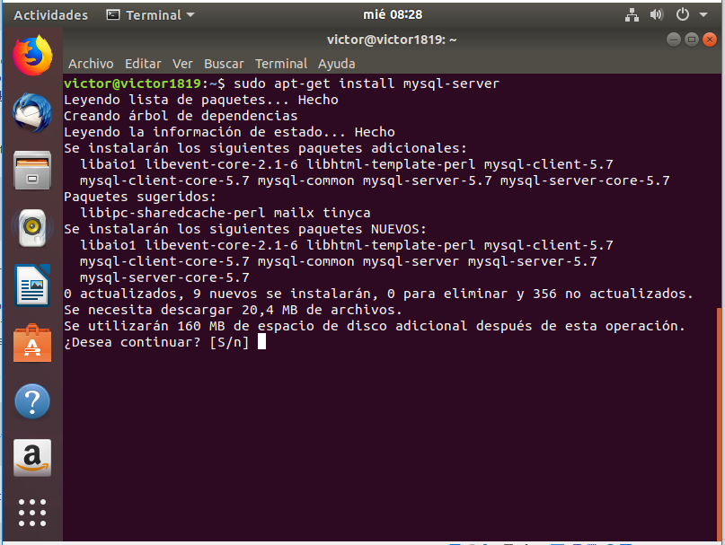
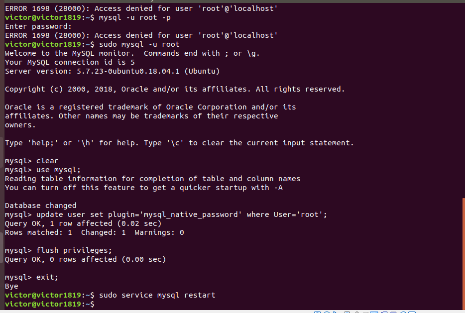
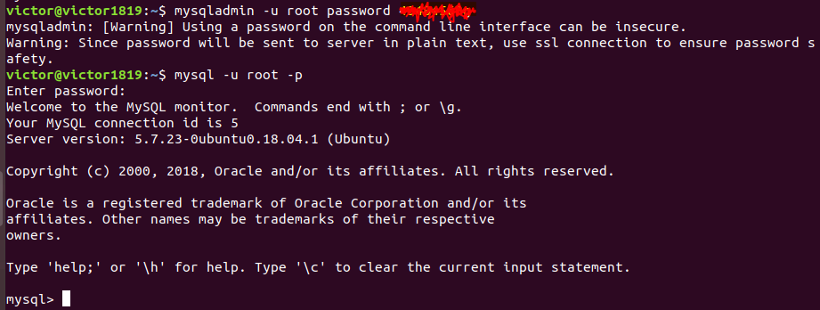
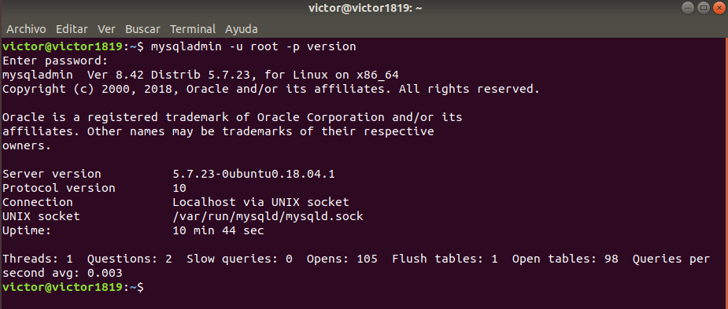

# U1_A2 - Instalación de MySQL Server en Ubuntu

## 1.- Instalar MySQL Server desde el gestor de paquetes.

> Es mejor primero actualizar antes de instalar el server.

 > Procedemos a instalar el servidor.

 Reiniciamos la máquina para asegurar la instalación.

 

 > Seguimos todos los pasos detallados en la última foto por si
 tuviéramos problemas a la hora de entrar.

> Estos son los pasos que hay que seguir si no tenemos manera de entrar
con la contraseña del admin.

Vemos que podemos entrar, por lo que está instalado.

## 2.-Instalar MySQL Cliente desde el gestor de paquetes.

## 3.- Indicar que versión estable instala desde el repositorio.

## 4.- Reiniciar el demonio mysqld, que arranca el núcleo de SGBD. Probar que este corriendo el proceso con: ps aux | grep mysql.

## 5.- Configuración de la seguridad post-instalación (ejecutar mysql_secure_installation)

## 6.- Probar la conexión al servidor,  utilizando el programa cliente mysql y con el usuario root

## 7.- Instalar MYSQL Workbench

## 8.- Instalar el PHPMYAdmin sobre Apache

## 9.- Además explicar lo siguiente, en base a la distribución linux instalada:

* Directorio de instalación base
* Directorio del servicio o proceso demonio
* Directorio de datos. Explicar lo que se encuentra en dicho directorio respecto a las bases de datos del servidor.
* Fichero de configuración del servidor y su ubicación
* ¿Quién es el usuario propietario de la instalación ?
* Aplicar el lenguaje de los mensajes de error  a español, modificando la configuración (indicar el directorio donde se aloja el fichero en español)
