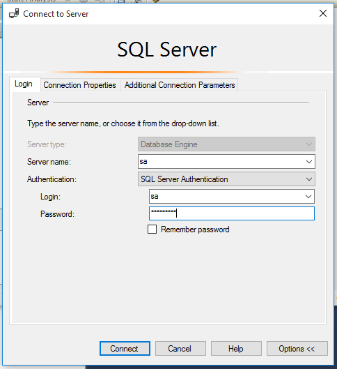
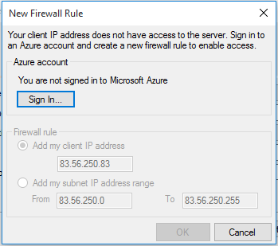

# U1_A3.- Instalación de SQL Server 2016 Express ó SQL Server 2016 Standard

Para empezar necesitaremos una máquina virtual con el sistema operativo Windows 10 instalado. Vamos a **https://www.hanselman.com/blog/DownloadSQLServerExpress.aspx** para descargar el SQL Server 2016.

Empezaremos instalando el SQL Server 2016 Express.

## 1. SQL Server Express 2016.

> Básica.

> Esto puede tardar un rato.

> Este es el aspecto del Server Express.

Introducimos credenciales.

## 2. SQL Server 2016 Management Studio.

> Este es el aspecto del Management Studio.

Al conectarnos por primera vez podemos tener el siguiente problema.

## 3. Conexiones desde Management Studio a SQL Server.
