# U1_A3.- Instalación de SQL Server 2016 Express ó SQL Server 2016 Standard

Para empezar necesitaremos una máquina virtual con el sistema operativo Windows 10 instalado. Vamos a **https://www.hanselman.com/blog/DownloadSQLServerExpress.aspx** para descargar el SQL Server 2016.

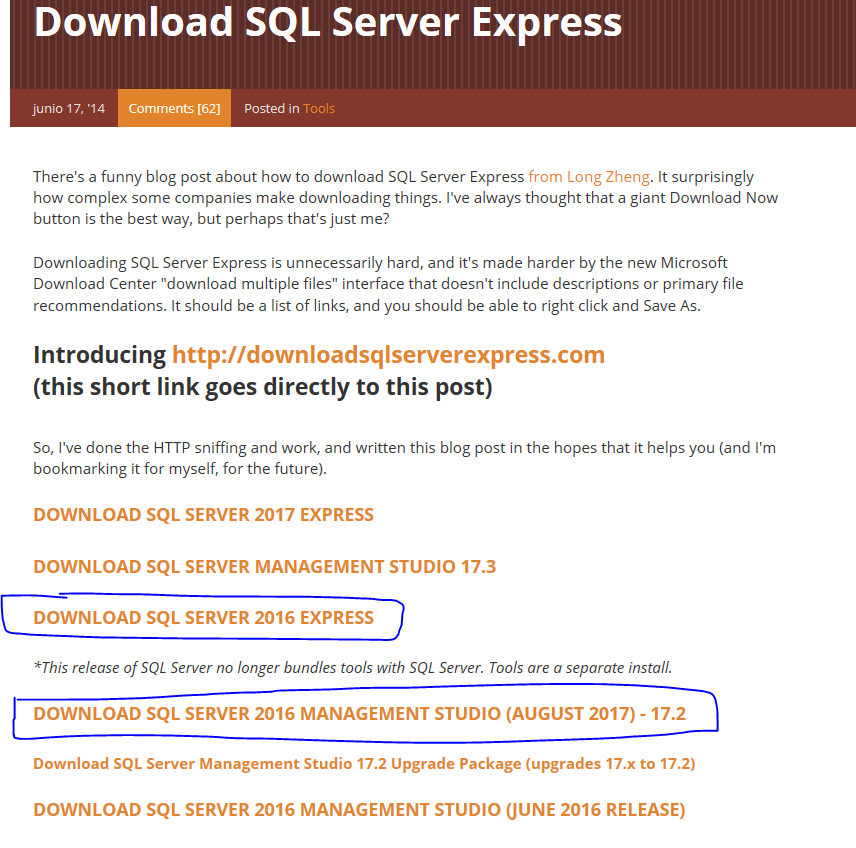

Empezaremos instalando el SQL Server 2016 Express.

## 1. SQL Server Express 2016.

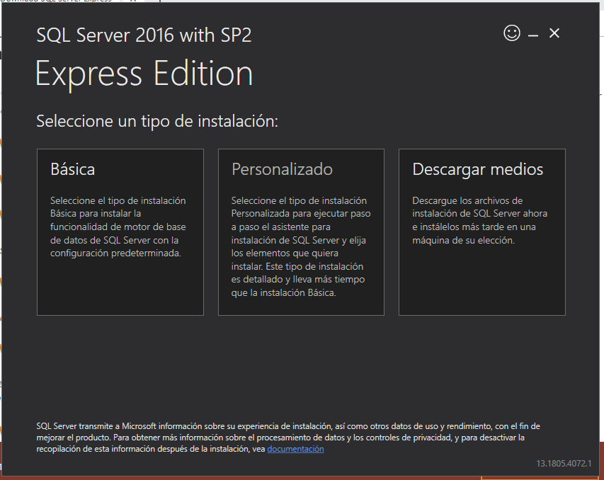

> Básica.

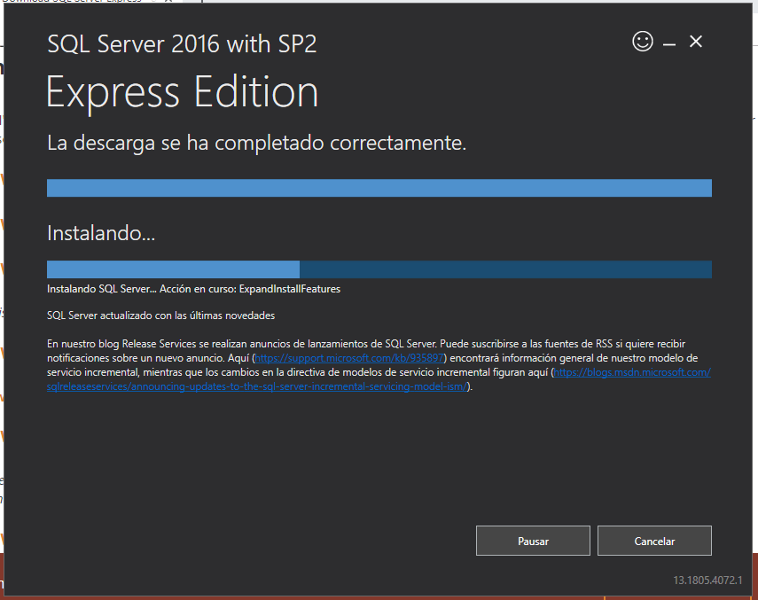

> Esto puede tardar un rato.

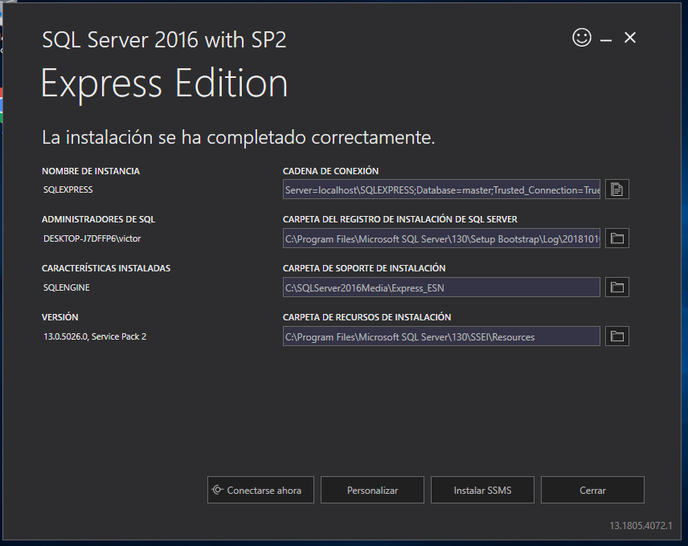

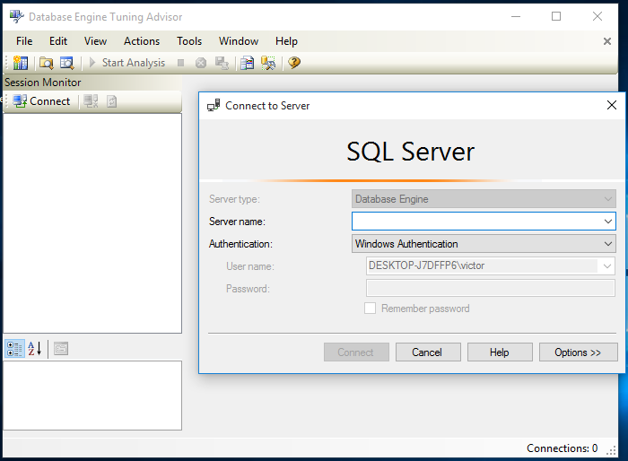

> Este es el aspecto del Server Express.

## 2. SQL Server 2016 Management Studio.

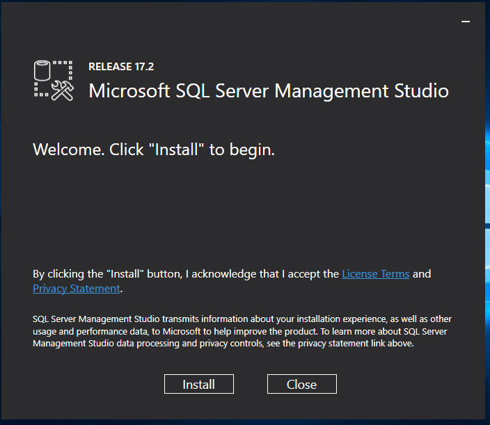

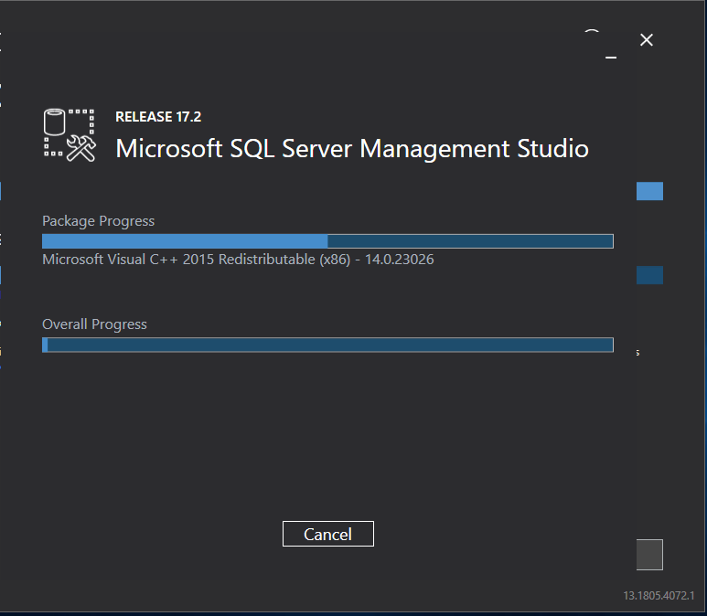

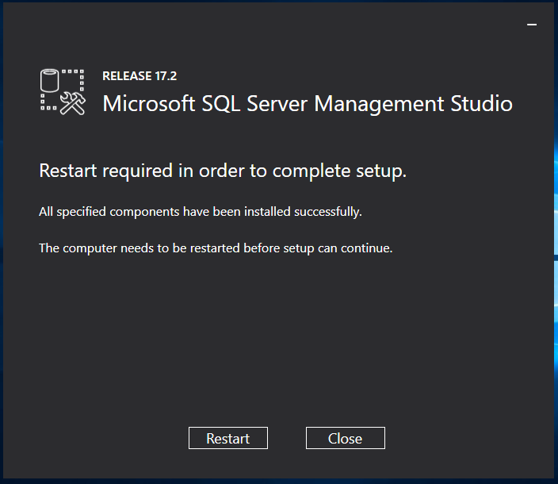

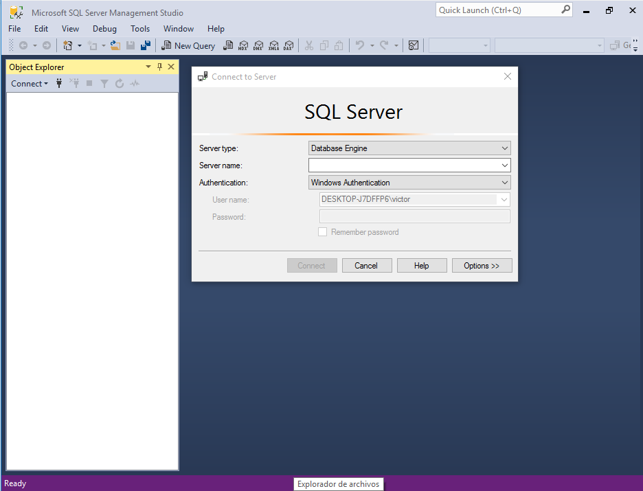

> Este es el aspecto del Management Studio.

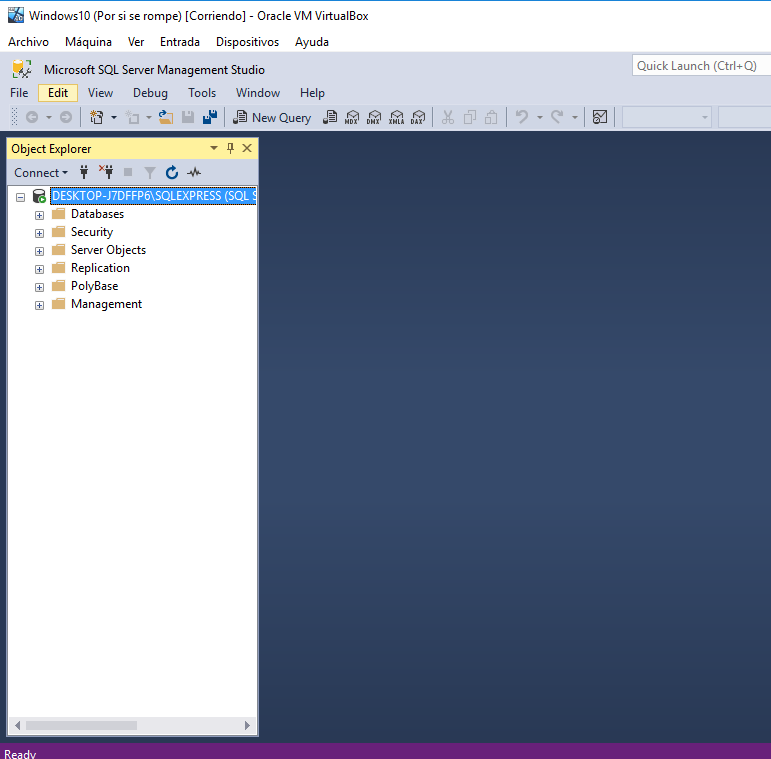

> Entramos con el server name que nos aparece en la lista. Esto es entrar por nombre de máquina.

Tenemos que entrar en el servicio de mantenimiento del SQL Server 2016 y vemos lo siguiente.

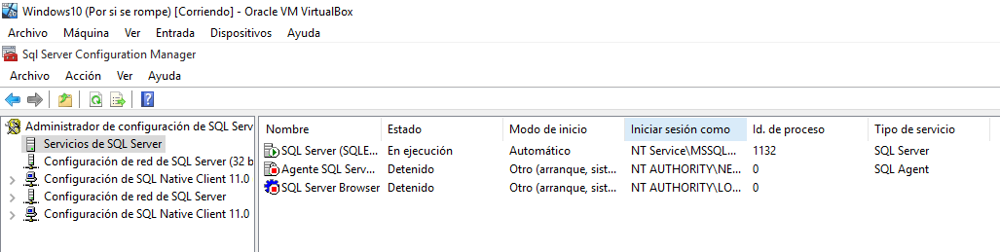

Botón derecho -> Iniciar.

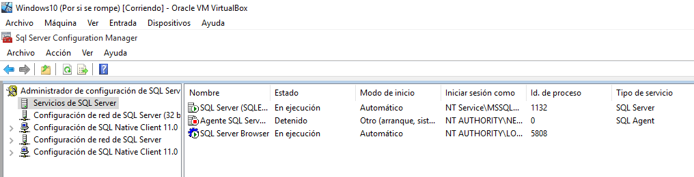

## 3. Conexiones desde Management Studio.

Es posible que sea necesario quitar el cortafuegos para conectar con otros dispositivos.

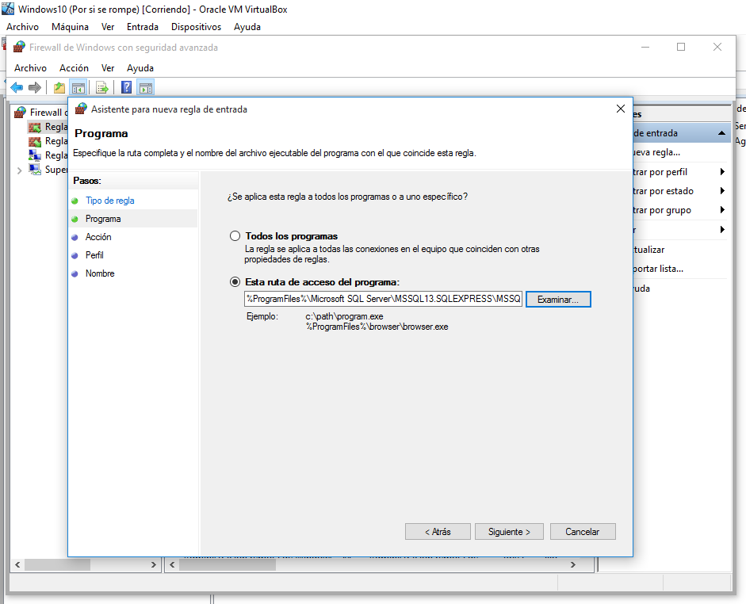

> Administramos una regla para dejarnos conectar con el cliente.

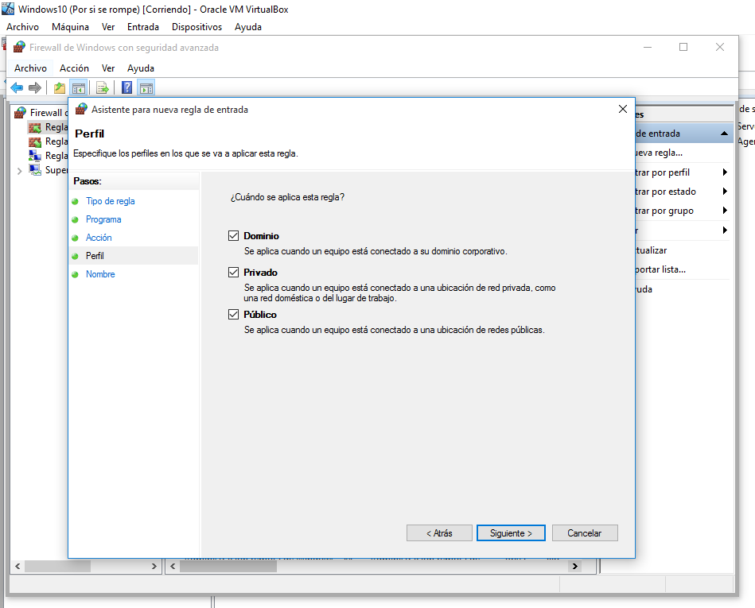

Si nada de esto funciona habría que desactivar completamente el cortafuegos.

## NOTA.

Cloné una máquina virtual a partir del servidor y cambié las IPs pero, ni aún así, es capaz de conectar el cliente y el servidor.
