# Privilegios y creación de usuarios.

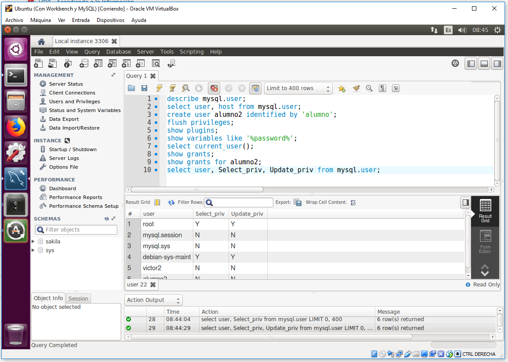

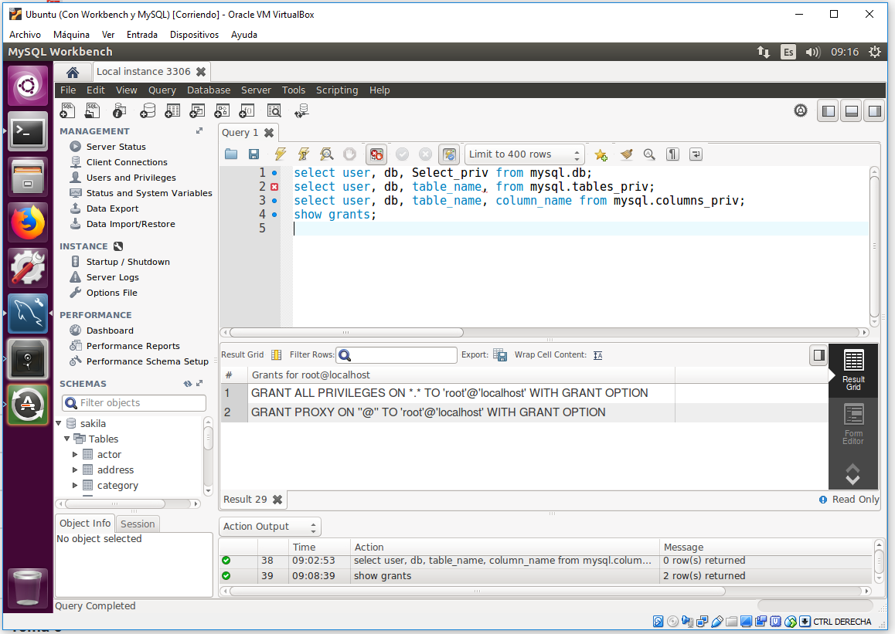

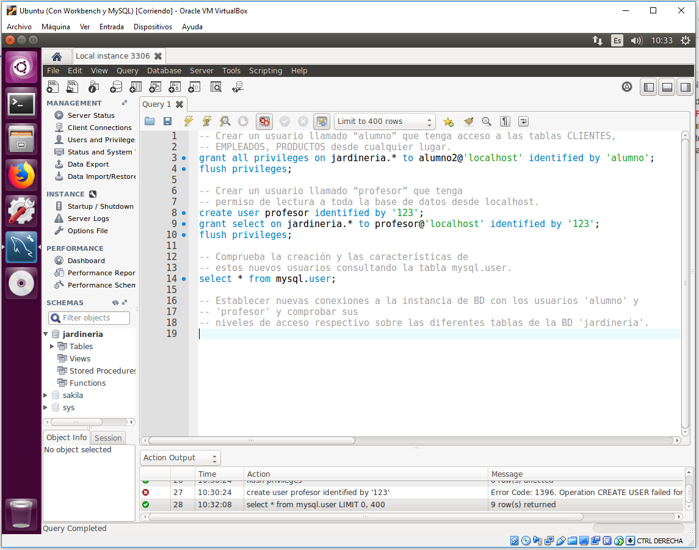

grant select on `*.*`

grant select on jardineria.Empleados to alumno;

flush privileges;

create user alumno@'172.19.14.11' identified by '123';

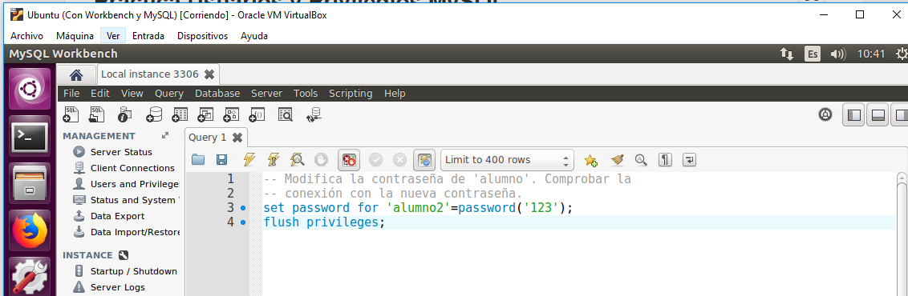

Modifica el host desde donde pueda acceder el alumno a una dirección IP determinada (del propio servidor o un cliente). Soluciona los problemas que pueda presentar esta modificación.

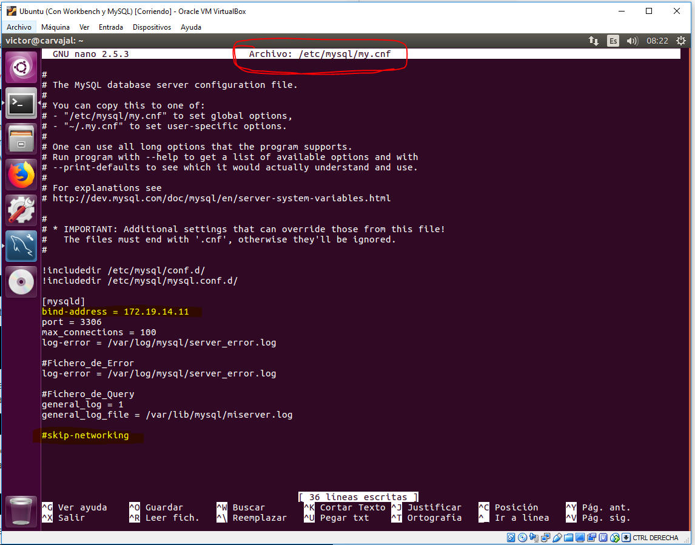

> Si se quiere volver a dejar como estaba: `bind-address = *`

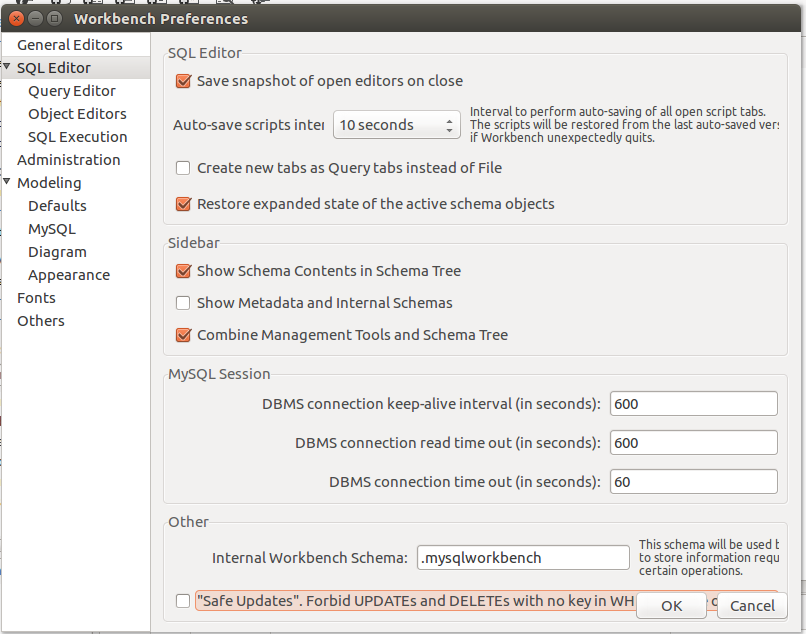

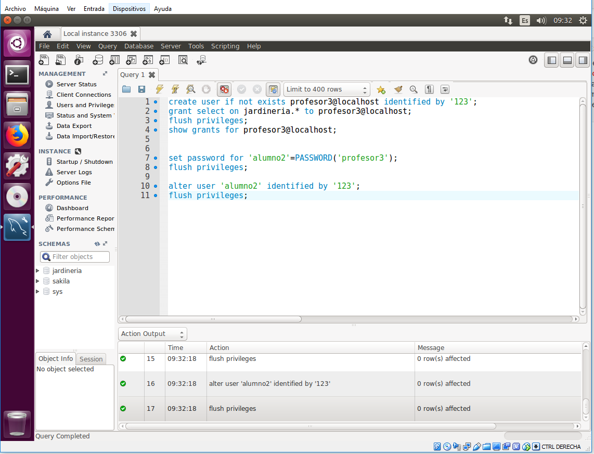

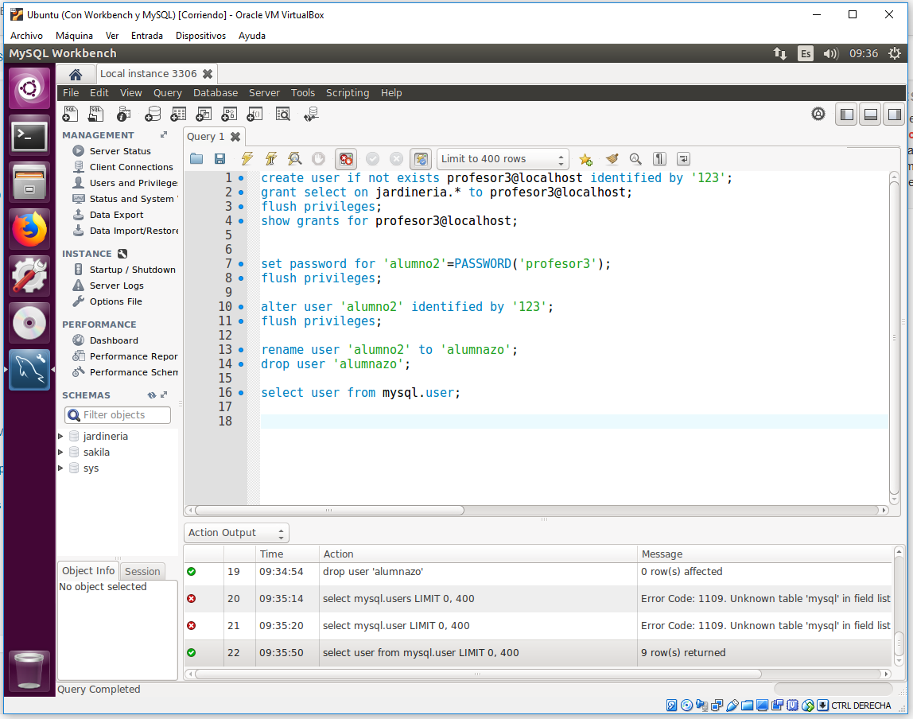

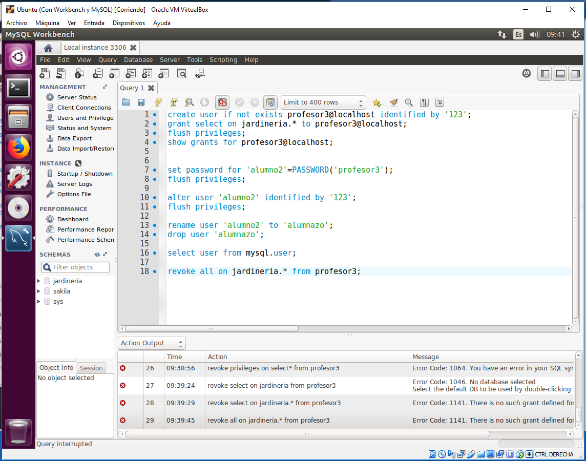

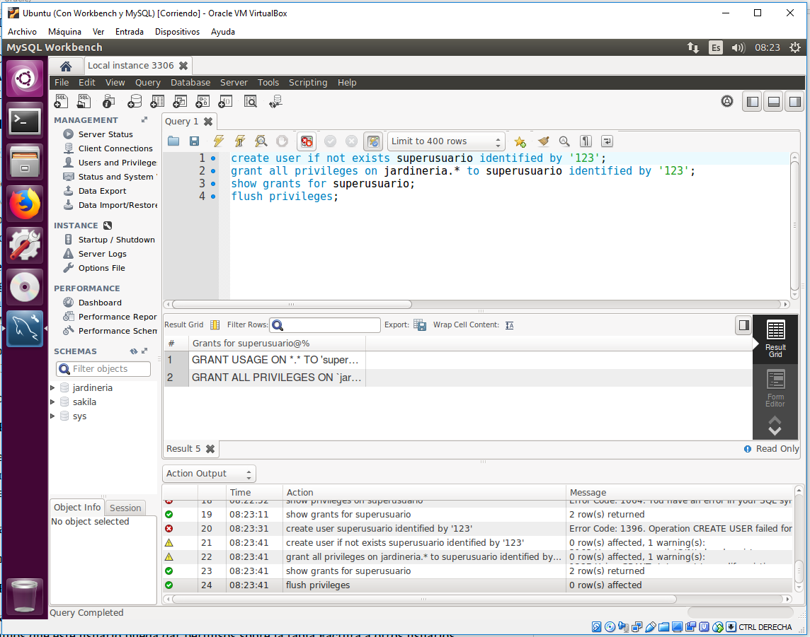

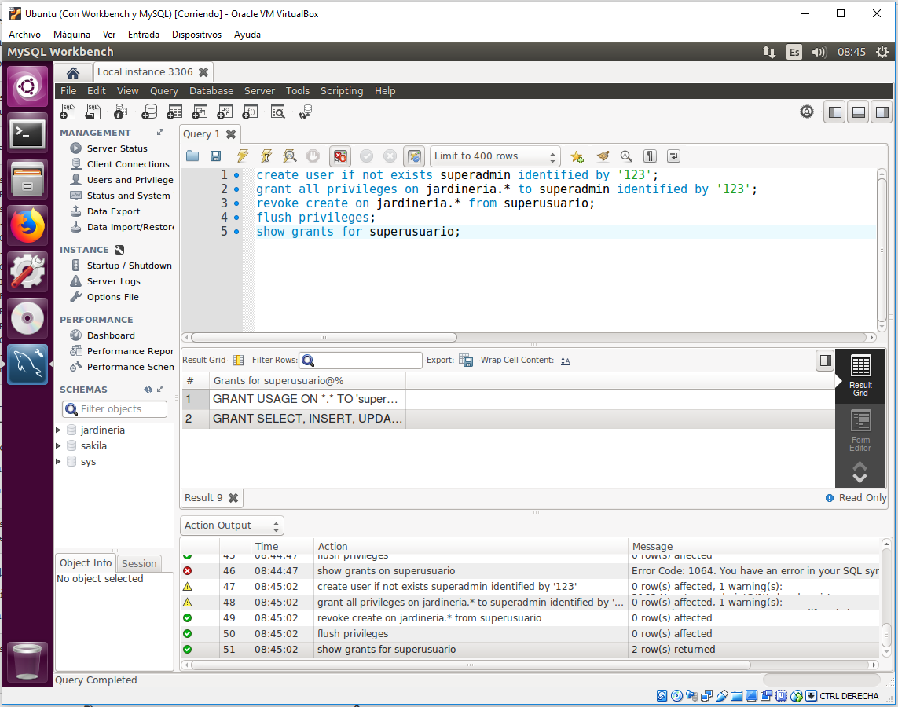

create view "NOMBRE" as "CONSULTA";

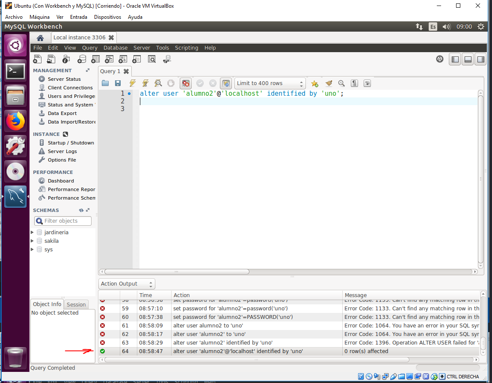

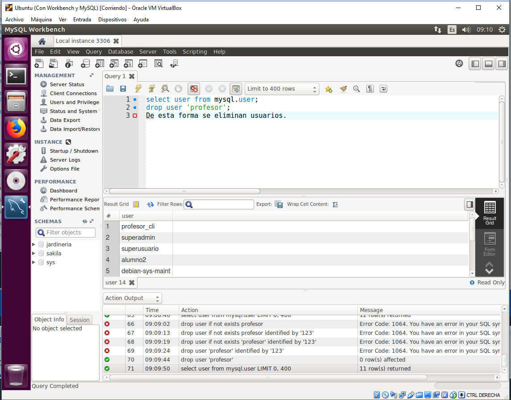

update "TABLA" set "LQUESEA"where "LOQUESEA";

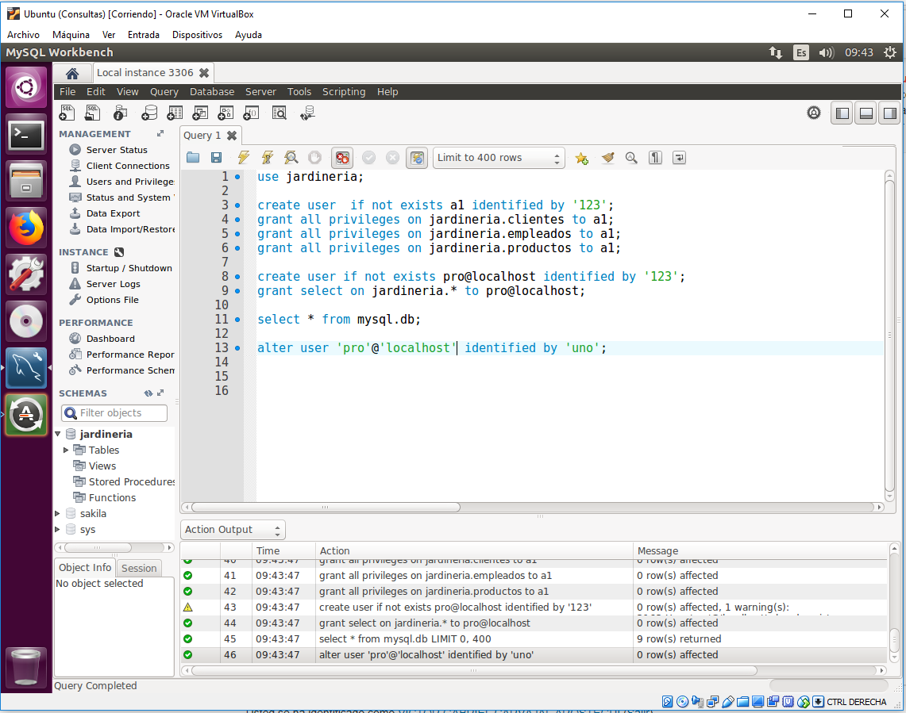
